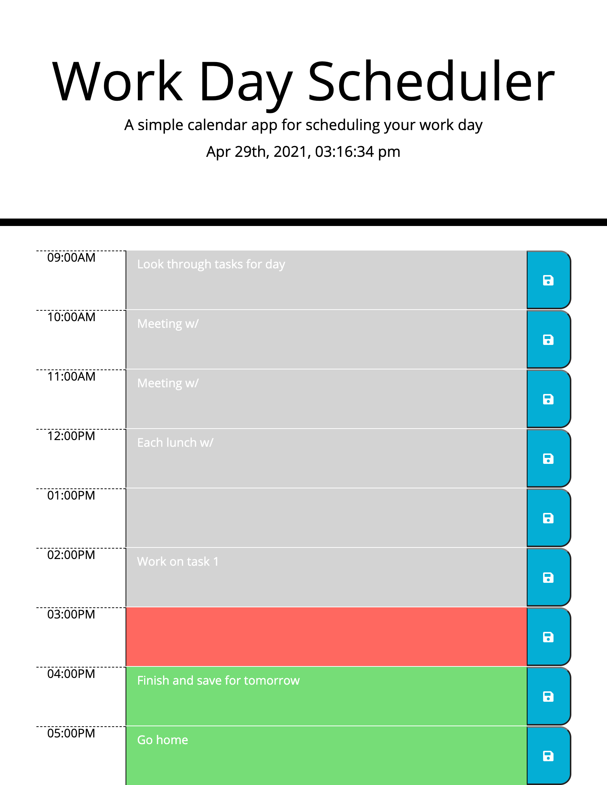

# Day-Planner

## Description

This application is a Day Planner for a typical 9-5 work day. The webpage gives the current date and time at the top of the page follwed by a grid that displays the hours of the day starting from 9AM to 5PM. Next to each hour is a text area to input a task/reminder and next to each text area is a save button with a floppy disk icon. The time blocks are color coded such that the current time block is highlighted in red, the future timeblocks are highlighted in green, and past timeblocks are highlighted in grey.

Users will be able to type in a task/reminder in the text area. They can then click the save button to save their task with the corresponding hour in local storage. On refresh the planner should still display the task/reminder in the same text area that it was saved in. Users are able to replace each task/reminder by going in to the text area and deleting the old task/reminder and typing in a new one and saving that to local storage. Future development of the application could include a button that will reset the entire planner and delete all tasks/reminders from local storage.

## Mock Up

The following image shows the web application's appearance and functionality:

## Technologies Used

* HTML
* CSS
* JavaScript
* jQuery
* BootStrap

## Links

GitHub: https://github.com/jkcanoy/Day-Planner

Live Page: https://jkcanoy.github.io/Day-Planner/

